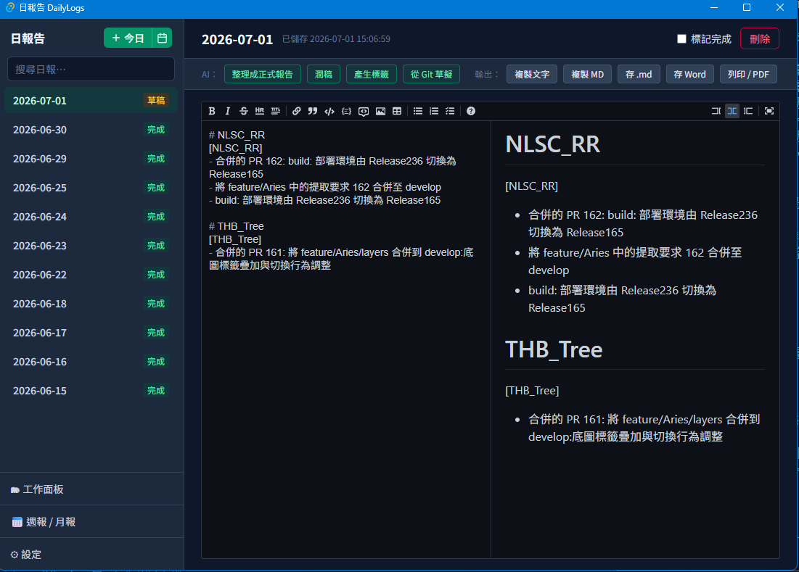
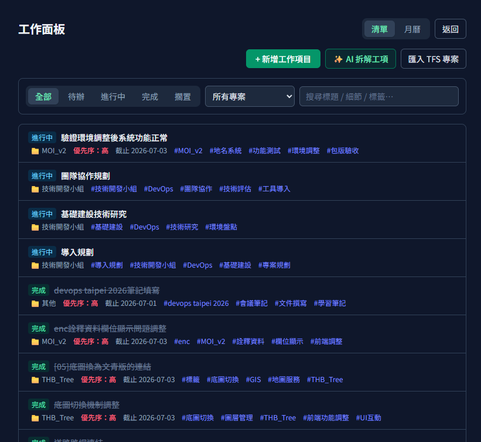

# 日報告 DailyLogs

撰寫工作日報的桌面應用程式。核心目標：降低「每天回想做了什麼 + 排版打字」的成本，並能一鍵產出可寄送/貼上的格式化日報。



## 功能

- **自由 Markdown 日報**：一天一份，內容即一段 Markdown，並排即時預覽，可自由用標題／清單／表格；停筆約 0.6 秒自動存草稿，可標記完成
- **AI 協助**：零散記事 → 正式日報、潤稿、自動下標籤、日報彙整成週／月報、AI 拆解工作項目（呼叫本機可設定的 CLI，預設 `claude -p`，也可用 `codex exec` 等；prompt 經 stdin 傳入，不經 shell）
- **工作面板**：以清單／月曆兩種檢視追蹤待辦工作項目，可由 AI 從描述拆解出工項
- **TFS 整合**：經 Azure DevOps REST API 抓指定 collection／作者當天的 commit，草擬進日報（PAT 只存本機）
- **輸出**：複製純文字、複製 Markdown、存 .md、存 Word、列印 / PDF
- **本機儲存與備份**：資料存 SQLite，全部資料可匯出／匯入 JSON（PAT 不含在備份內）



## 文件

- [使用說明書](docs/使用說明書.md)：完整操作說明與截圖
- [安裝與使用指南](docs/安裝與使用指南.md)：Windows 安裝面向
- [CI/CD 建置流程](docs/CI-CD建置流程.md)：Azure Pipeline 自動建置

## 技術

- [Tauri 2](https://tauri.app/)（Rust 後端）
- React 19 + TypeScript + Vite + Tailwind CSS v4
- SQLite（`rusqlite`，bundled）

前後端橋接：前端透過 `src/lib/api.ts` 的 typed wrapper 呼叫 Rust 端 `#[tauri::command]`（`src-tauri/src/commands.rs`）。

## 開發

```bash
npm install
npm run tauri dev      # 開發模式（WSL 需 WSLg 才能顯示視窗）
npm run tauri build    # 打包
npm run build          # 僅前端：tsc 型別檢查 + vite build
npm run test           # 前端測試（vitest）
npm run lint           # eslint
```

需先安裝 [Rust](https://rustup.rs/) 與 Tauri 的系統相依套件，見官方 [prerequisites](https://tauri.app/start/prerequisites/)。Rust 端驗證用 `cargo check`（在 `src-tauri/` 下執行）。

## 打包 Windows 執行檔（WSL / Linux 交叉編譯）

Tauri 官方不支援從 Linux 交叉編譯 MSI（需 WiX），但可用 [`cargo-xwin`](https://github.com/rust-cross/cargo-xwin) 產出 exe 與 NSIS 安裝程式。

一次性環境準備：

```bash
cargo install cargo-xwin
rustup target add x86_64-pc-windows-msvc
```

打包：

```bash
npm run tauri build -- --runner cargo-xwin --target x86_64-pc-windows-msvc --bundles nsis
```

- `--bundles nsis` 為必要：MSI 在 Linux 上做不出來，不限定會在 MSI 步驟失敗。
- 產物位於 `src-tauri/target/x86_64-pc-windows-msvc/release/`：
  - `dailylogs.exe`：獨立執行檔
  - `bundle/nsis/日報告 DailyLogs_<version>_x64-setup.exe`：NSIS 安裝程式（建議發布此版，會引導安裝 WebView2）
- 交叉編譯不會簽章；未簽章的 exe 在 Windows 上會觸發 SmartScreen 警告。
- 目標機若為 Windows 10 且未內建 WebView2 Runtime，直接執行獨立 exe 可能無法開啟，故對外發布優先給安裝程式版本。
- 發布前記得同步更新 `package.json`、`src-tauri/tauri.conf.json` 與 `src-tauri/Cargo.toml` 的 `version`。

## 打包 Linux 執行檔

Linux 為原生 host，直接打包即可（不需交叉編譯）：

```bash
npm run tauri build
```

產物位於 `src-tauri/target/release/`：

- `dailylogs`：裸執行檔（靠系統提供 WebKitGTK 等相依）
- `bundle/appimage/日報告 DailyLogs_<version>_amd64.AppImage`：可攜單檔，內含相依，`chmod +x` 後即可執行（對外發布建議用此格式）
- `bundle/deb/日報告 DailyLogs_<version>_amd64.deb`：Debian/Ubuntu 安裝包
- `bundle/rpm/日報告 DailyLogs-<version>-1.x86_64.rpm`：Fedora/RHEL 安裝包

> WSLg 環境下執行任一產物前，需先 `export WEBKIT_DISABLE_DMABUF_RENDERER=1`，否則 WebKitGTK 會靜默閃退（一般 Linux 桌面通常不需要）。

## 專案結構

```
src/                  前端（React）
  components/         Sidebar, ReportEditor, DatePicker, TaskBreakdownPanel,
                      TaskEditCard, ProjectInput, ErrorBoundary
  views/              SettingsView, WorkView（工作面板）, WeeklyView（週/月報）,
                      TaskListPanel, TaskCalendarPanel
  lib/                api（呼叫 Rust）、ai（prompt 工程）、format（Markdown/純文字）、
                      export（各格式輸出）、theme（主題配色）
  types.ts            Report / Task 型別等
src-tauri/src/
  db.rs               SQLite 結構與 CRUD
  commands.rs         #[tauri::command] 對前端的 API
  ai.rs               執行外部 AI CLI（prompt 經 stdin）
  tfs.rs              Azure DevOps REST API 取 commit
  lib.rs              app 進入點、DB 初始化
```

資料庫位置：系統的 app data 目錄下 `dailylogs.db`。
