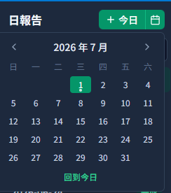
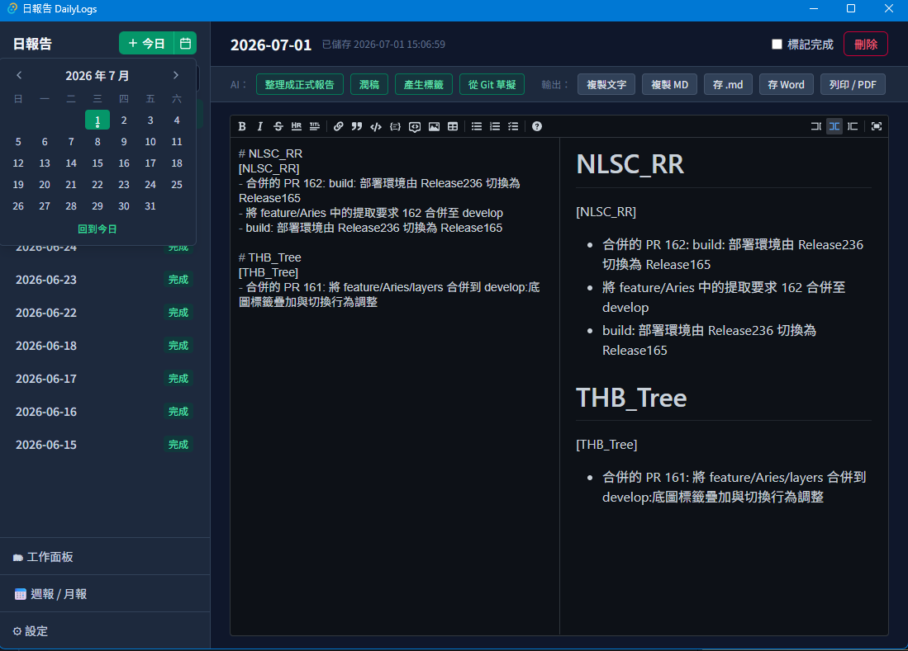
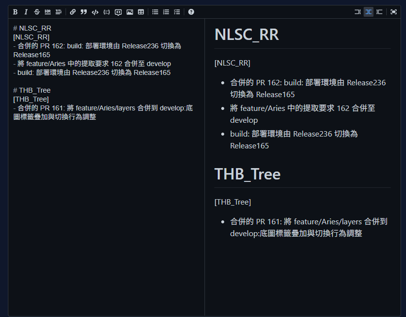
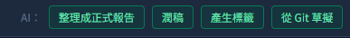
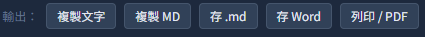
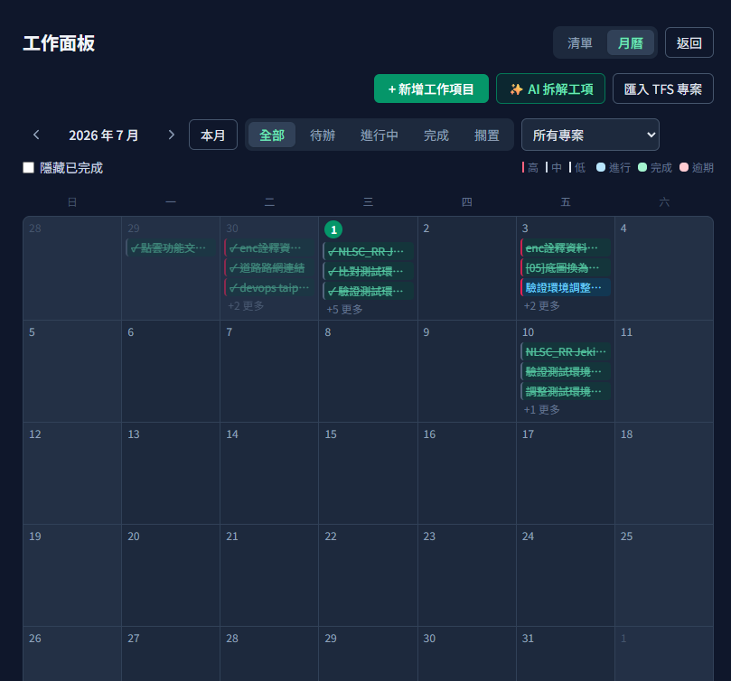
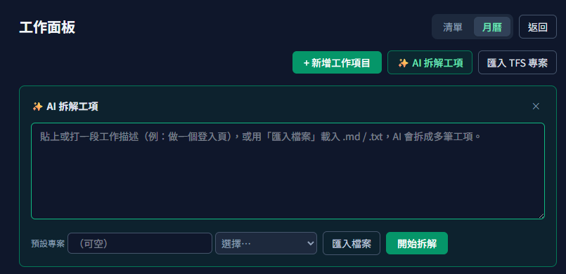
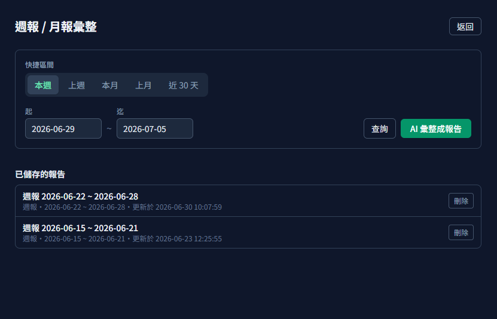
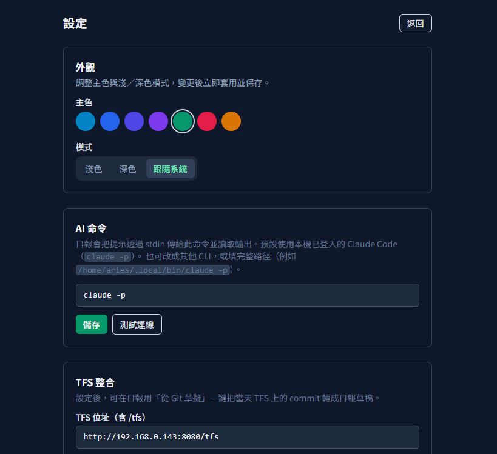
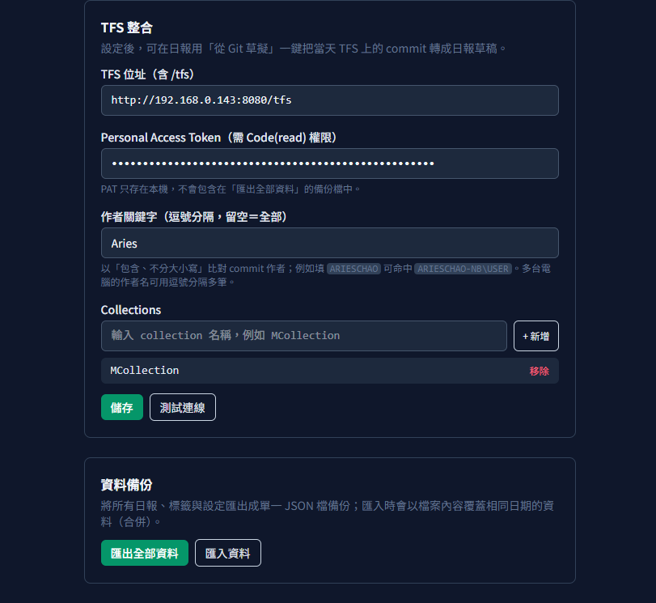

# 日報告 DailyLogs 使用說明書

> 本說明書提供給第一次使用「日報告 DailyLogs」的同事。內容以「怎麼操作」為主，跟著步驟做即可上手。

---

## 目錄

1. [這是什麼、能幫我做什麼](#1-這是什麼能幫我做什麼)
2. [開始使用](#2-開始使用)
3. [寫今天的日報](#3-寫今天的日報)
4. [讓 AI 幫忙](#4-讓-ai-幫忙)
5. [匯出與分享](#5-匯出與分享)
6. [工作面板（追蹤待辦）](#6-工作面板追蹤待辦)
7. [週報 / 月報彙整](#7-週報--月報彙整)
8. [設定](#8-設定)
9. [常見問題與小提示](#9-常見問題與小提示)

---

## 1. 這是什麼、能幫我做什麼

**日報告 DailyLogs** 是一個寫工作日報的桌面小工具。它幫你把「今天做了什麼」隨手記下來，再用 AI 幫你排版整理，最後一鍵產出可以直接寄送或貼上的日報。

你可以用它來：

- 每天隨手記錄工作內容（支援 Markdown，愛怎麼排就怎麼排）。
- 按一個鍵，讓 AI 把零散的記事整理成正式報告、幫你潤稿、自動加標籤。
- 用「工作面板」追蹤待辦事項（清單或月曆檢視），還能從 TFS 匯入專案清單。
- 串接 TFS / Git，一鍵把當天的提交（commit）標題帶進日報。
- 把一整週 / 一整月的日報，用 AI 彙整成一份週報或月報。
- 匯出成純文字、Markdown、Word 或 PDF，方便分享。

所有資料都存在你自己的電腦上，不會上傳到雲端。

---

## 2. 開始使用

開啟「日報告」後，會直接進入**今天的日報編輯畫面**。整個視窗分成兩大塊：

- **左側邊欄**：切換日期、搜尋日報、進入工作面板 / 週報月報 / 設定。
- **右側編輯區**：撰寫與整理當天的日報。

<!-- 截圖：整個應用主畫面，左側邊欄 + 右側日報編輯器，標出兩大區塊 -->

**側邊欄下方**有三個常用入口：

| 按鈕           | 用途                              |
| -------------- | --------------------------------- |
| 🗂 工作面板    | 管理待辦工作項目（清單 / 月曆）   |
| 📅 週報 / 月報 | 把多天日報彙整成一份報告          |
| ⚙ 設定         | 設定 AI 命令、TFS、外觀、資料備份 |

---

## 3. 寫今天的日報

### 3.1 開啟日報

- 點側邊欄上方的 **「+ 今日」** 按鈕，就會開啟今天的日報。
- 想寫別天的日報，點旁邊的**日曆圖示**展開月曆，直接點選日期。
  - 日期上有**綠點**＝那天日報已標記「完成」；**黃點**＝還是「草稿」。
  - 點月曆下方的 **「回到今日」** 可快速跳回今天。

<!-- 截圖：側邊欄展開的月曆彈窗，可看到日期上的綠點/黃點與「回到今日」 -->

<!-- 截圖：整個視窗中側邊欄展開月曆的樣子（含右側日報） -->

側邊欄也會列出所有已寫過的日報，每筆顯示日期與狀態標籤（**完成** / **草稿**）。想找舊日報時，用上方的 **「搜尋日報…」** 輸入關鍵字，結果會高亮顯示符合的片段。

### 3.2 撰寫內容

編輯區是一個 Markdown 編輯器，**左邊寫、右邊即時預覽**。你可以自由使用標題、清單、表格等語法，直接寫下：

- 今天做了什麼
- 遇到什麼問題
- 明天要做什麼

不用手動存檔——**停止打字約 0.6 秒後會自動儲存**。畫面上方會顯示「儲存中…」或「已儲存 HH:MM:SS」。

<!-- 截圖：日報上方的日期與「已儲存 時間」狀態列 -->

<!-- 截圖：Markdown 編輯器，左側編輯 + 右側預覽，上方可見「已儲存 時間」狀態 -->

### 3.3 標記完成與刪除

- 寫完後，勾選右上角的 **「標記完成」**，日報狀態就會從「草稿」變成「完成」。
- 要刪除某天的日報，點 **「刪除」**（紅色按鈕），會跳出確認視窗，確認後才會刪除，**無法復原**。

---

## 4. 讓 AI 幫忙

編輯器工具列上有一排以 **「AI：」** 開頭的按鈕。這些功能會呼叫 AI 幫你處理日報內容。

<!-- 截圖：編輯器工具列的「AI：」按鈕區（整理成正式報告 / 潤稿 / 產生標籤 / 從 Git 草擬） -->

| 按鈕               | 功能                                                                     |
| ------------------ | ------------------------------------------------------------------------ |
| **整理成正式報告** | 把你零散的記事（加上工作面板的工項）重新組織成有分類、有排版的正式報告。 |
| **潤稿**           | 保留原本內容，只修飾用詞與語氣。（內容空白時會提示先寫點東西）           |
| **產生標籤**       | AI 自動分析內容，產生 2～5 個分類標籤，加到日報上。                      |
| **從 Git 草擬**    | 抓取你當天在 TFS / Git 上的提交（commit）標題，追加到日報末尾。          |

**操作方式**：按下按鈕後，工具列會顯示「AI 處理中：…」，完成後會跳出「AI 已完成：…」的綠色提示；如果失敗會顯示錯誤訊息。

> **使用前提**
>
> - AI 功能需要先在 **設定 → AI 命令** 設好可用的 AI 命令（預設是本機已登入的 `claude -p`）。
> - **「從 Git 草擬」** 需要先在 **設定 → TFS 整合** 填好連線資訊，否則會提示找不到符合的提交。

---

## 5. 匯出與分享

工具列上另一排以 **「輸出：」** 開頭的按鈕，用來把日報帶出去分享。

<!-- 截圖：編輯器工具列的「輸出：」按鈕區（複製文字 / 複製 MD / 存 .md / 存 Word / 列印 PDF） -->

| 按鈕           | 用途               | 產出                       |
| -------------- | ------------------ | -------------------------- |
| **複製文字**   | 複製成無格式純文字 | 貼到通訊軟體、Email 都乾淨 |
| **複製 MD**    | 複製 Markdown 原文 | 貼到支援 Markdown 的地方   |
| **存 .md**     | 另存成 Markdown 檔 | 檔名預設 `日報_日期.md`    |
| **存 Word**    | 另存成 Word 檔     | 檔名預設 `日報_日期.docx`  |
| **列印 / PDF** | 開啟系統列印視窗   | 可選擇印出或「另存為 PDF」 |

---

## 6. 工作面板（追蹤待辦）

點側邊欄的 **「🗂 工作面板」** 進入。這裡用來管理你的待辦工作項目，右上角可切換 **「清單」** 或 **「月曆」** 兩種檢視，點 **「返回」** 回到日報。

### 6.1 清單檢視

以列表呈現所有工作項目，可用上方的篩選列快速找到：

- **狀態**：全部 / 待辦 / 進行中 / 完成 / 擱置
- **專案**：依專案名稱過濾
- **關鍵字**：搜尋標題、細節、標籤

<!-- 截圖：工作面板清單檢視，含上方狀態/專案/關鍵字篩選列與任務清單 -->

### 6.2 月曆檢視

把工作項目依截止日排在月曆上，一眼看出哪天事情多。可切換月份、勾選 **「隱藏已完成」**，並用顏色區分優先序（高/中/低）與狀態（進行中/完成/逾期）。點某一天可展開當天詳情，也能直接在該天新增工作。

<!-- 截圖：工作面板月曆檢視，可見色彩圖例、每格的工作卡片與「隱藏已完成」 -->

### 6.3 新增與編輯工作項目

點 **「+ 新增工作項目」** 開啟編輯卡片，可填寫：

| 欄位   | 說明                                         |
| ------ | -------------------------------------------- |
| 標題   | 必填                                         |
| 狀態   | 待辦 / 進行中 / 完成 / 擱置                  |
| 優先序 | 高 / 中 / 低                                 |
| 專案   | 可從已有專案自動補全                         |
| 截止日 | 可選、可清除                                 |
| 標籤   | 以逗號分隔；可點 **「✨ AI 標籤」** 自動產生 |
| 細節   | 支援 Markdown                                |

填好按 **「儲存」**。要刪除時按 **「刪除」**，再點一次 **「確認刪除」** 才會真的刪掉。

### 6.4 AI 拆解工項

如果有一段比較大的工作描述，可以讓 AI 幫你拆成多筆小工項：

1. 點 **「✨ AI 拆解工項」**。
2. 貼上或輸入工作描述（也可用 **「匯入檔案」** 載入 `.md` / `.txt`）。
3. （可選）設定「預設專案」。
4. 點 **「開始拆解」**，AI 會產生多筆草稿。
5. 逐筆檢視、調整（標題、優先序、細節…），不要的按「移除」。
6. 點 **「全部建立」** 一次建立所有工項。

<!-- 截圖：AI 拆解工項面板，輸入描述 + 產生的草稿清單 -->

> 其他：篩選單一專案時，會出現 **「AI 彙整進度」** 按鈕，讓 AI 統整該專案目前進度；若已設定 TFS，可用 **「匯入 TFS 專案」** 一次帶入專案清單。

---

## 7. 週報 / 月報彙整

點側邊欄的 **「📅 週報 / 月報」** 進入。這裡把某段期間的多份日報，用 AI 彙整成一份完整報告。

操作步驟：

1. 選擇區間——可用快捷鈕 **本週 / 上週 / 本月 / 上月 / 近 30 天**，或自訂「起」「迄」日期。
2. （可選）點 **「查詢」** 先看看這段期間有幾份日報。
3. 點 **「AI 彙整成報告」**，AI 會把多份日報整合成一份。
4. 修改報告標題（會自動帶入預設標題），並在編輯器裡調整內容。
5. 點 **「💾 儲存到 DB」**（或 **「💾 更新」**）把報告存起來，下次可從「已儲存的報告」清單載入。
6. 用 **「複製」／「存 .md」／「列印 / PDF」** 匯出分享。

<!-- 截圖：週報/月報頁面，含快捷區間鈕、彙整結果編輯器與「已儲存的報告」清單 -->

---

## 8. 設定

點側邊欄的 **「⚙ 設定」** 進入。設定分成四區，每區改完點該區的 **「儲存」** 即可。

<!-- 截圖：設定頁面全貌，可見外觀 / AI 命令 / TFS 整合 / 資料備份四個區塊 -->

### 8.1 外觀

- **主色**：點色圓切換介面主色。
- **模式**：淺色 / 深色 / 跟隨系統。變更後立即生效。

### 8.2 AI 命令

- 這是所有 AI 功能背後執行的命令，預設 `claude -p`（本機已登入的 Claude Code）。
- 可改成其他 CLI，或填完整路徑（例如 `/home/aries/.local/bin/claude -p`）。常見範例：

  | AI CLI            | 命令範例                           |
  | ----------------- | ---------------------------------- |
  | Claude Code       | `claude -p`                        |
  | OpenAI Codex CLI  | `codex exec --skip-git-repo-check` |
  | Google Gemini CLI | `gemini -p`                        |

- 填好可點 **「測試連線」** 確認能不能用，成功會顯示「✅ 可用」。

> **命令必須符合的條件**：程式會把 prompt 從**標準輸入（stdin）**送進去、再讀**標準輸出（stdout）**當結果。命令字串以空白拆成「程式 + 參數」，**不經過 shell**，所以不能用管線 `|`、重新導向 `>` 或引號。填入的 CLI 需支援「讀 stdin、輸出純文字到 stdout」的非互動模式。

### 8.3 TFS 整合

設定後就能用日報的 **「從 Git 草擬」** 把當天 TFS 上的提交轉成日報草稿。需填：

| 欄位                  | 說明                                                           |
| --------------------- | -------------------------------------------------------------- |
| TFS 位址              | 例如 `http://192.168.0.143:8080/tfs`（含 /tfs）                |
| Personal Access Token | 需有 Code(read) 權限；只存在本機                               |
| 作者關鍵字            | 用「包含、不分大小寫」比對提交作者，多筆用逗號分隔；留空＝全部 |
| Collections           | 逐個新增你要掃描的 collection 名稱                             |

填好可點 **「測試連線」**，成功會顯示找到幾個 repo。

**如何取得 Personal Access Token（PAT）**

1. 用瀏覽器登入你的 TFS（例如 `http://192.168.0.143:8080/tfs`）。
2. 點右上角個人頭像旁的 **設定圖示 ⚙ → Security（安全性）**，或直接開 **My profile → Security**。
3. 選左側的 **Personal Access Tokens**，點 **New Token（新增權杖）**。
4. 填寫：
   - **Name**：自己看得懂的名稱，例如 `DailyLogs`。
   - **Expiration（到期日）**：依需求選擇（到期後需重新產生）。
   - **Scopes（權限範圍）**：至少勾選 **Code → Read**（讀取程式碼）。
5. 點 **Create**，畫面會顯示一長串權杖字串。
6. **立刻複製**這串字串貼到本欄——關閉視窗後就再也看不到，只能重新產生。

> PAT 等同你的帳號密碼，請勿外流；本工具只把它存在你自己的電腦，也不會寫進備份檔。

<!-- 截圖：設定頁的 TFS 整合區塊（TFS 位址 / PAT / 作者關鍵字 / Collections）與資料備份區塊 -->

### 8.4 資料備份

- **匯出全部資料**：把所有日報、標籤、工作項目與設定匯出成一個 JSON 檔備份。
- **匯入資料**：從備份 JSON 還原，會**覆蓋相同日期**的資料（會先跳出確認視窗）。

> 為了安全，Personal Access Token（PAT）**不會**包含在備份檔裡。

---

## 9. 常見問題與小提示

**Q. 我沒手動存檔，內容會不會不見？**
不會。日報停止打字約 0.6 秒後就會自動儲存，工作項目與設定則是按「儲存」後立即存檔。

**Q. 按 AI 按鈕出現這些提示是什麼意思？**

| 提示                        | 意思                                       |
| --------------------------- | ------------------------------------------ |
| 內容是空的，先寫點東西      | 「潤稿」時日報還沒有內容                   |
| 沒有內容可整理              | 「整理成正式報告」時日報與工作項目都是空的 |
| 今天沒有符合的 commit       | 「從 Git 草擬」找不到當天符合作者的提交    |
| 沒有新的 commit（都已加入） | 當天的提交先前都已加進日報了               |
| 此區間沒有日報              | 「AI 彙整成報告」時這段期間沒有任何日報    |

**Q. 用 Codex CLI 但一直失敗、測試連線不過？**
如果你的 Codex 是用 **npm**（例如 `npm install -g @openai/codex`）裝的，請先**移除**它，改用**官方提供的安裝方式**重新安裝：

1. 移除 npm 版：`npm uninstall -g @openai/codex`。
2. 依 [Codex 官方說明](https://github.com/openai/codex) 用官方方式重新下載安裝。
3. 回「設定 → AI 命令」重新填 `codex exec --skip-git-repo-check`，再點 **「測試連線」** 確認。

**小提示**

- 各種彈窗（日曆、工作項目編輯、當日詳情）都可按 **Esc** 關閉。
- 所有資料都存在你自己的電腦，不會上傳雲端；換電腦時可用「匯出／匯入全部資料」搬家。
- AI 相關功能都依賴「設定 → AI 命令」；如果 AI 都失敗，先回設定頁點「測試連線」確認。

---

_本說明書對應日報告 DailyLogs。介面文字、按鈕名稱以實際版本為準。_
